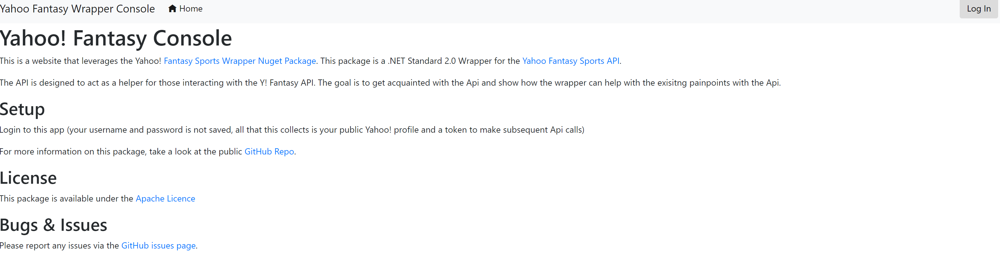
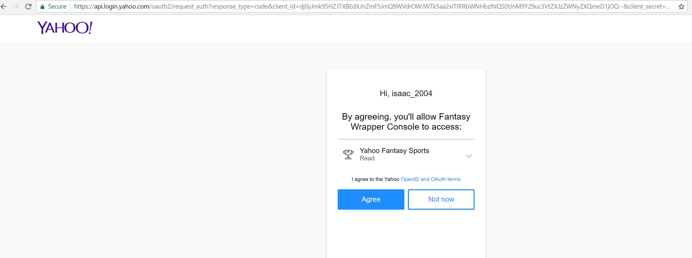
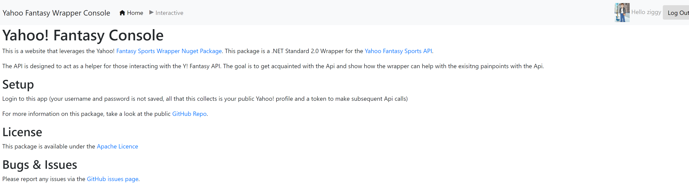

# YahooFantasyWrapper

Wrapper for the Yahoo Fantasy Sports API. Includes Authorization and Data Retrieval. Written in C# Targeting Dot Net Standard 2.0. There is also a sample app here, which is deployed to [http://yfantasywrapper.azurewebsites.net](http://yfantasywrapper.azurewebsites.net)

#Using the Sample App
- Go to [http://yfantasywrapper.azurewebsites.net](http://yfantasywrapper.azurewebsites.net)
- Click Login




- You will be directed to Yahoo! Auth Page, and asked to login (notice the url is Yahoo! meaning the app does not collect or track login information


- After logging in and giving app read-only access to profile, you will be directed back to Home, with logged in status



### Using this Wrapper
- git clone
- Reference project in solution

> Per [Microsoft](https://docs.microsoft.com/dotnet/standard/net-standard), Dot Net Standard 2.0 supports development in Dot Net Core 2.0, .Net Framework 4.6.1, Mono 5.4, UWP vNext, and various versions of Xamarin. 

### Getting Api Access from Yahoo
- Direct to [Yahoo Apps Page](https://developer.yahoo.com/apps/)
- Fill Out Form as needed
- Be sure set Callback to http://lvh.me
- Copy Client Id and Client Secret (note Callback Domain as well)

### Dot Net Core 2.0 Example
- Create Add Configuration Details from Yahoo in appsettings.json
````
  "YahooConfiguration": {
    "ClientSecret": "",
    "RedirectUri": "",
    "ClientId": ""
  }  
````
- In `Startup.cs` *ConfigureServices*, configure instance of `YahooConfiguration` class to use throughout application

````
 services.Configure<YahooConfiguration>(Configuration.GetSection("YahooConfiguration"));
 ````
 
 - In Service you want to Inject Wrapper into, build controller
 
 ````
        private readonly IYahooAuthClient _client;
        private readonly IYahooFantasyClient _fantasy;

        public YahooService(IYahooAuthClient client, IYahooFantasyClient fantasyClient)
        {
            _client = client;
            _fantasy = fantasyClient;
        }
 ````
 
 You are now ready to start the process of invoking OAuth Flow
 
 ### Calling Yahoo Api
 
 In order to call the Api (fantasy sports content), you need to obtain an Access Token from Yahoo using OAuth 2.0. Review the [Yahoo OAuth 2.0 Guide](https://developer.yahoo.com/oauth2/guide/) for more information on this. To obtain an Access Token, we will leverage the YahooClient instance from the Wrapper. The steps are as follows
 
 - Get Url of Yahoo Auth Page
 `_client.GetLoginLinkUri();`
 - This will build a Uri with the Client Id, Client Secret, and Redirect Uri supplied eariler.
 - You will be brought to Yahoo Login and eventually App Access Authorization Page. Click Agree
 - Yahoo will validate your app, and redirect back to your Redirect Uri with added QS of `?code=authCode`
 - Your callback uri will need to capture the request, collect the QS and validate the user and obtain a token
 
 ````
 await _client.GetUserProfile(System.Web.HttpUtility.ParseQueryString(Request.QueryString.Value));
 ````
 - At this point, we have everthing we need to call the Yahoo Fantasy Sports Api. 
 ````
 //Get 2017 Football Leagues for Logged-In User
_fantasy.GetLeagues(new string[] { "371" }, EndpointSubResourcesCollection.BuildResourceList(EndpointSubResources.MetaData), _client.Auth.AccessToken)
 ````
 - There you have it, a List of Leagues that you can do what you want. This Wrapper is used by a Football Trade Analyzer that I wrote
 http://fantasytradeanalyzerweb.azurewebsites.net
 
 
 The goal is to provide complete support of the Yahoo Api. For more information on the Api, reference the [Doc on Yahoo](https://developer.yahoo.com/fantasysports/guide/)
 
 # If you would like to contribute, let me know. I could use the help!
 
 ----

# License

[](https://opensource.org/licenses/Apache-2.0)

Copyright (c) 2017 [Isaac Levin](https://github.com/isaac2004)
----
 
 ### Follow me online:

Twitter: [@isaac2004](http://twitter.com/isaac2004)

----
 
 
